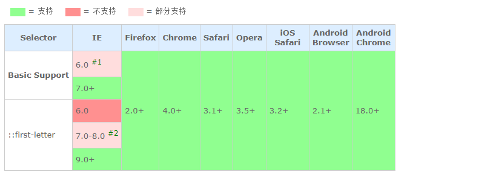
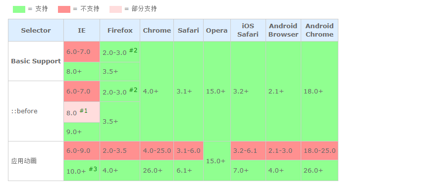
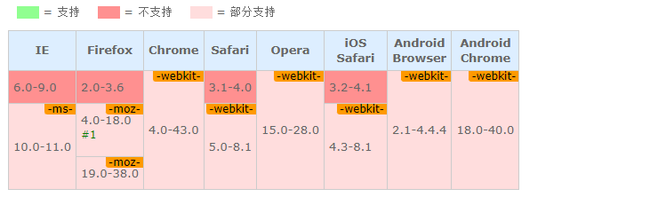

[选择器列表](/css/selectors/)

# 伪对象选择符

<p class="g-color-light">
  <strong class="g-color-css3-change">紫色</strong> 链接表示该属性在CSS3有修改或者增加了新的属性值；
  <strong class="g-color-css3-new">橙色</strong> 链接表示该属性是CSS3新增属性
</p>

|选择器|版本|描述|
|:---|:---|:---|
|[<span class="g-color-css3-change">E:first-letter/E::first-letter</span>](#_1)|CSS1/3|设置对象内的第一个字符的样式|
|[<span class="g-color-css3-change">E:first-line/E::first-line</span>](#_2)|CSS1/3|设置对象内的第一行的样式|
|[<span class="g-color-css3-change">E:before/E::before</span>](#_3)|CSS2/3|设置在对象前（依据对象树的逻辑结构）发生的内容。用来和content属性一起使用|
|[<span class="g-color-css3-change">E:after/E::after</span>](#_4)|CSS2/3|设置在对象后（依据对象树的逻辑结构）发生的内容。用来和content属性一起使用|
|[<span class="g-color-css3-new">E::placeholder</span>](#_5)|CSS3|设置对象文字占位符的样式|
|[<span class="g-color-css3-new">E::selection</span>](#_6)|CSS3|设置对象被选择时的颜色|


## E:first-letter/E::first-letter :id=_1

### 语法

```css
E:first-letter/E::first-letter {
  sRules
}
```

### 说明

**设置对象内的第一个字符的样式**

- 此伪对象仅作用于块对象。内联对象要使用该伪对象，必须先将其设置为块级对象

- 该伪类常被用来配合[font-size](#)属性和[float](#)属性制作首字下沉效果

- IE6在使用该选择符时有个显式的BUG：选择符与包含规则的花括号之间不能紧挨着，需留有空格或换行。同时还存在该BUG的选择符包括：[E:first-line](#_2)

- CSS3将伪对象选择符(Pseudo-Element Selectors)前面的单个冒号(:)修改为双冒号(::)用以区别伪类选择符(Pseudo-Classes Selectors)，但以前的写法仍然有效。**即E:first-letter可转化为E::first-letter**

### 兼容性



1. E:first-letter选择符不能紧挨着规则集大括号，需留有空格或换行

2. 本质上并不支持伪元素的双冒号(::)写法，而是忽略掉了其中的一个冒号，仍以单冒号来解析，所以等同变相支持了E::first-letter

### 示例

<!-- tabs:start -->

#### **html**

```html
<h1>杂志常用的首字下沉效果</h1>
<p>今天，阳光明媚，晴空万里，非常适合户外活动，如踏青、远足之类的。长期坐在办公室的同学们要多注意运动。</p>
```

#### **css**

```css
h1 {
  font-size: 16px;
}

p {
  width: 200px;
  padding: 5px 10px;
  border: 1px solid #ddd;
  font: 14px/1.5 simsun, serif, sans-serif;
}

p:first-letter {
  float: left; font-size: 40px; font-weight: bold; line-height: 1;
}

p::first-letter {
  float: left;
  font-size: 40px;
  font-weight: bold;
  line-height: 1;
}
```

<!-- tabs:end -->

运行结果

<iframe
  class="output-iframe"
  scrolling="no"
  frameborder="0"
  src="css-handbook/example/selectors/pseudo-element/1.html"
>
  浏览器不支持iframe
</iframe>

---

## E:first-line/E::first-line :id=_2

### 语法

```css
E:first-line/E::first-line {
  sRules
}
```

### 说明

**设置对象内的第一行的样式**

- 此伪对象仅作用于块对象。内联对象要使用该伪对象，必须先将其设置为块级对象

- IE6在使用该选择符时有个显式的BUG：选择符与包含规则的花括号之间不能紧挨着，需留有空格或换行。同时还存在该BUG的选择符包括：[E:first-letter](#_1)

- CSS3将伪对象选择符(Pseudo-Element Selectors)前面的单个冒号(:)修改为双冒号(::)用以区别伪类选择符(Pseudo-Classes Selectors)，但以前的写法仍然有效, **即E:first-line可转化为E::first-line**

### 兼容性


1. E:first-line选择符不能紧挨着规则集大括号，需留有空格或换行

2. 本质上并不支持伪元素的双冒号(::)写法，而是忽略掉了其中的一个冒号，仍以单冒号来解析，所以等同变相支持了E::first-line

### 示例

<!-- tabs:start -->

#### **html**

```html
<h1>第一行文字的颜色与其它不同</h1>
<p>今天，阳光明媚，晴空万里，非常适合户外活动，如踏青、远足之类的。长期坐在办公室的同学们要多注意运动。</p>
```

#### **css**

```css
h1 {
  font-size: 16px;
}

p {
  width: 200px;
  padding: 5px 10px;
  border: 1px solid #ddd;
  font: 14px/1.5 simsun, serif, sans-serif;
}

p:first-line {
  color: #090;
}

p::first-line {
  color: #090;
}
```

<!-- tabs:end -->

运行结果

<iframe
  class="output-iframe"
  scrolling="no"
  frameborder="0"
  src="css-handbook/example/selectors/pseudo-element/2.html"
>
  浏览器不支持iframe
</iframe>

---

## E:before/E::before :id=_3

### 语法

```css
E:before/E::before {
  sRules
}
```

### 说明

**设置在对象前（依据对象树的逻辑结构）发生的内容。用来和[content](#)属性一起使用，并且必须定义content属性**

CSS3将伪对象选择符(Pseudo-Element Selectors)前面的单个冒号(:)修改为双冒号(::)用以区别伪类选择符(Pseudo-Classes Selectors)，但以前的写法仍然有效。**即E:before可转化为E::before**

### 兼容性



1. 本质上并不支持伪元素的双冒号(::)写法，而是忽略掉了其中的一个冒号，仍以单冒号来解析，所以等同变相支持了E::before

2. 不支持设置属性position, float, list-style-*和一些display值，Firefox3.5开始取消这些限制

3. IE10在使用伪元素动画有一个问题：

  ```css
  .test:hover {}
  .test:hover::before { /* 这时animation和transition才生效 */ }
  ```

  !> 需要使用一个空的:hover来激活

### 示例

<!-- tabs:start -->

#### **html**

```html
<p>Sorry, 你的浏览器不支持E:before和E::before</p>
```

#### **css**

```css
p {
  position: relative;
  color: #f00;
  font-size: 14px;
  font-size: 0\9;
  *font-size: 14px;
}

p:before {
  position: absolute;
  background: #fff;
  color: #000;
  content: "如果你的能看到这段文字，说明你的浏览器只支持E:before";
  font-size: 14px;
}

p::before {
  position: absolute;
  background: #fff;
  color: #000;
  content: "如果你的能看到这段文字，说明你的浏览器支持E:before和E::before";
  font-size: 14px;
}
```

<!-- tabs:end -->

运行结果

<iframe
  class="output-iframe"
  scrolling="no"
  frameborder="0"
  src="css-handbook/example/selectors/pseudo-element/3.html"
>
  浏览器不支持iframe
</iframe>

---

## E:after/E::after :id=_4

### 语法

```css
E:after/E::after {
  sRules
}
```

### 说明

**设置在对象后（依据对象树的逻辑结构）发生的内容。用来和[content](#)属性一起使用，并且必须定义content属性**

CSS3将伪对象选择符(Pseudo-Element Selectors)前面的单个冒号(:)修改为双冒号(::)用以区别伪类选择符(Pseudo-Classes Selectors)，但以前的写法仍然有效。**即E:after可转化为E::after**

### 兼容性


1. 本质上并不支持伪元素的双冒号(::)写法，而是忽略掉了其中的一个冒号，仍以单冒号来解析，所以等同变相支持了E::after

2. 不支持设置属性position, float, list-style-*和一些display值，Firefox3.5开始取消这些限制

3. IE10在使用伪元素动画有一个问题：

  ```css
  .test:hover {}
  .test:hover::after { /* 这时animation和transition才生效 */ }
  ```

  !> 需要使用一个空的:hover来激活

### 示例

<!-- tabs:start -->

#### **html**

```html
<p>Sorry, 你的浏览器不支持E:after和E::after</p>
```

#### **css**

```css
p {
  position: relative;
  color: #f00;
  font-size: 14px;
  font-size: 0\9;
  *font-size: 14px;
}

p:after {
  position: absolute;
  left: 0;
  background: #fff;
  color: #000;
  content: "如果你的能看到这段文字，说明你的浏览器只支持E:after";
  font-size: 14px;
}

p::after {
  position: absolute;
  left: 0;
  background: #fff;
  color: #000;
  content: "如果你的能看到这段文字，说明你的浏览器支持E:after和E::after";
  font-size: 14px;
}
```

<!-- tabs:end -->

运行结果

<iframe
  class="output-iframe"
  scrolling="no"
  frameborder="0"
  src="css-handbook/example/selectors/pseudo-element/4.html"
>
  浏览器不支持iframe
</iframe>

---

## E::placeholder :id=_5

### 语法

```css
E::placeholder {
  sRules
}
```

### 说明

**设置对象文字占位符的样式**

- ::placeholder 伪元素用于控制表单输入框占位符的外观，它允许开发者/设计师改变文字占位符的样式，默认的文字占位符为浅灰色

- 当表单背景色为类似的颜色时它可能效果并不是很明显，那么就可以使用这个伪元素来改变文字占位符的颜色

- 需要注意的是，除了Firefox是 ::[prefix]placeholder，其他浏览器都是使用 ::[prefix]input-placeholder

- Firefox支持该伪元素使用[text-overflow](#)属性来处理溢出问题

<!-- tabs:start -->

#### **例子**

**html**

```html
<input type="text" placeholder="占位符" />
```

**css**

```css
input::-webkit-input-placeholder {
	color: #999;
}
input:-ms-input-placeholder { /*IE10+*/
	color: #999;
}
input:-moz-placeholder { /*Firefox4-18*/
	color: #999;
}
input::-moz-placeholder { /*Firefox19+*/
	color: #999;
}
```

**运行结果**

<iframe
  class="output-iframe"
  scrolling="no"
  frameborder="0"
  src="css-handbook/example/selectors/pseudo-element/5.html"
>
  浏览器不支持iframe
</iframe>

<!-- tabs:end -->

### 兼容性



1. ::-moz-placeholder 伪元素在Firefox 19+替代了之前的 :-moz-placeholder 伪类

### 示例

<!-- tabs:start -->

#### **html**

```html
<input id="test" placeholder="Placeholder text!">
```

#### **css**

```css
input::-webkit-input-placeholder {
	color: #999;
}
input:-ms-input-placeholder { /*IE10+*/
	color: #999;
}
input:-moz-placeholder { /*Firefox4-18*/
	color: #999;
}
input::-moz-placeholder { /*Firefox19+*/
	color: #999;
}
```

<!-- tabs:end -->

运行结果

<iframe
  class="output-iframe"
  scrolling="no"
  frameborder="0"
  src="css-handbook/example/selectors/pseudo-element/5.html"
>
  浏览器不支持iframe
</iframe>

## E::selection :id=_6

### 语法

```css
E::selection {
  sRules
}
```

### 说明

**设置对象被选择时的样式**

需要注意的是，::selection只能定义被选择时的[background-color](#)，[color](#)及[text-shadow](#)(IE11尚不支持定义该属性)

### 兼容性

<br />

|浏览器|版本
|:---|:---|
|IE|<span style="color: red;">6.0-8.0;</span> 9.0+|
|Firefox|2.0+|
|Chrome|4.0+|
|Safari|3.1+|
|Opera|3.5+|
|iOS Safari|3.2+|
|Android Browser|2.1+|
|Android Chrome|18.0+|

### 示例

<!-- tabs:start -->

#### **html**

```html
<h1>选中下面的文字，看看它的颜色</h1>
<p>你选中这段文字后，看看它们的文本颜色和背景色，就能明白::selection的作用。</p>
```

#### **css**

```css
p::-moz-selection {
  background: #000;
  color: #f00;
}

p::selection {
  background: #000;
  color: #f00;
}
```

<!-- tabs:end -->

运行结果

<iframe
  class="output-iframe"
  scrolling="no"
  frameborder="0"
  src="css-handbook/example/selectors/pseudo-element/6.html"
>
  浏览器不支持iframe
</iframe>
