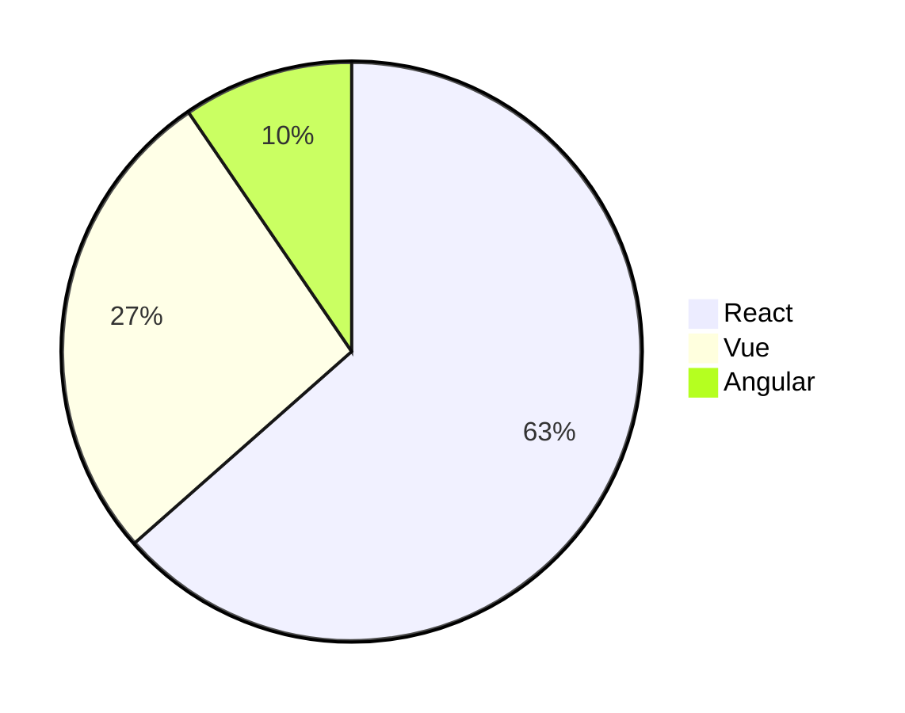
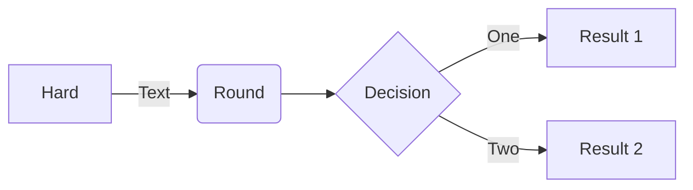
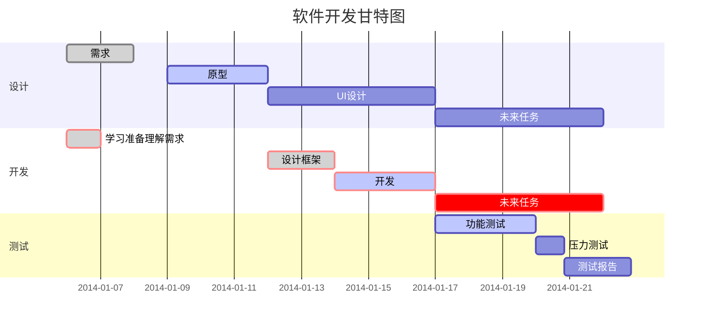

# Markdown语法 :id=markdown <!-- {docsify-ignore-all} -->

## 字体效果 :id=font

<!-- tabs:start -->

#### **斜体**

语法:
```
*斜体文本*

_斜体文本_
```

输出:

<output>
  <em>斜体效果</em>
  <br />
  <em>斜体文本</em>
</output>

#### **加粗**

语法:

```
**加粗文本**
```

输出:

<output>
  <strong>加粗文本</strong>
</output>

#### **删除文本**

语法:

```
~~删除文本~~
```

输出:

<output>
  <del>删除文本</del>
</output>

#### **标记文本**

语法:

```
==标记文本==
```

输出:

<output>
  <mark>标记文本</mark>
</output>

#### **上标**

语法:

```
这是^上标^
```

输出:

<output>
  这是<sup>上标</sup>
</output>


#### **下标**

语法:

```
这是~下标~
```

输出:

<output>
  这是<sub>下标</sub>
</output>

<!-- tabs:end -->

---

## 标题 :id=title

```
# 一级标题
## 二级标题
### 三级标题
#### 四级标题
##### 五级标题
###### 六级标题
```

<output>
	<h1>一级标题</h1>
	<h2>二级标题<h2>
	<h3>三级标题<h3>
	<h4>四级标题</h4>
	<h5>五级标题</h5>
	<h6>六级标题</h6>
</output>

---


## 链接 :id=link

```
[链接名称](url)
```

链接还有一个方便快捷的方式 `[link][num]`，其中num就是数字，例如`[link]1`，然后在文末贴出`[num]`到链接的映射如`[1]:https://github.com/docsifyjs/docsify`

<output>
	<a href="https://github.com/docsifyjs/docsify" target="_blank" rel="noopener">docsify</a>
</output>

---

## 图片 :id=image

```

```

<output>
	
</output>

带链接的图片

```
[](url)
```

<output>
	<a href="https://github.com/karoldy/" target="_blank" rel="noopener">
    
  </a>
</output>

---

## 分割线 :id=hr

```
***

---

___
```

<output>
	<hr style="border-bottom: 1px solid rgba(0, 0, 0, 0.3)" />
	<hr style="border-bottom: 1px solid rgba(0, 0, 0, 0.3)" />
	<hr style="border-bottom: 1px solid rgba(0, 0, 0, 0.3)" />
</output>

---

## 引用 :id=blockquote

```
> 引用的文本
```

<output>
	<blockquote>引用的文本</blockquote>
</output>

---

## 列表 :id=list

<!-- tabs:start -->

#### **无序列表**

语法:

```
- 1
	- 1-1 
- 2
	- 2-1
		- 2-1-1
- 3
```

输出:

<output>
	<ul>
    <li>
      1
      <ul>
        <li>1-1 </li>
      </ul>
    </li>
    <li>
      2
      <ul>
        <li>
          2-1
          <ul>
            <li>2-1-1</li>
          </ul>
        </li>
      </ul>
    </li>
    <li>3</li>
  </ul>
</output>

#### **有序列表**

语法:

```
1. 苹果
   1. 红苹果
2. 香蕉
   1. 熟香蕉
      1. 唔熟
   2. 生香蕉
3. 橙子
```

输出:

<output>
	<ol>
		<li>
			苹果
			<ol>
				<li>红苹果</li>
			</ol>
		</li>
		<li>
			香蕉
			<ol>
				<li>熟香蕉
					<ol>
						<li>唔熟</li>
					</ol>
				</li>
				<li>生香蕉</li>
			</ol>
		</li>
		<li>橙子</li>
	</ol>
</output>

<!-- tabs:end -->

---

## 表格 :id=table

```
|表头1|表头2|
|:---|:---|
|内容1|内容2|
```

<output>
	<table>
    <thead>
      <tr>
        <th align="left">表头1</th>
        <th align="left">表头2</th>
      </tr>
    </thead>
    <tbody>
      <tr>
        <td>内容1</td>
        <td>内容2</td>
      </tr>
    </tbody>
  </table>
</output>

设定内容居中、居左、居右

使用`:---:`居中

使用`:---`居左

使用`---:`居右

```
|表头1|表头2|表头3|
|:---:|:---|---:|
|内容1|内容2|内容3|
```

<output>
  <table>
    <thead>
      <tr>
        <th align="center">表头1</th>
        <th align="left">表头2</th>
        <th align="right">表头3</th>
      </tr>
    </thead>
    <tbody>
      <tr>
        <td align="center">内容1</td>
        <td align="left">内容2</td>
        <td align="right">内容3</td>
      </tr>
    </tbody>
  </table>
</output>

---

## 注脚 :id=footnotes

```
一个文本(有注脚)[^1]

<!-- 文末添加 -->
[^1]: 注脚的解释
```

---

## 待办事项 id=todo

```
- [ ] 未完成的任务
- [x] 完成的任务
	- [ ] 任务2-1
```

<output>
  <ul class="task-list">
    <li class="task-list-item">
      <label><input disabled="" type="checkbox"> 未完成的任务</label>
    </li>
    <li class="task-list-item">
      <label>
        <input checked="" disabled="" type="checkbox">
        完成的任务
        <ul class="task-list">
          <li class="task-list-item">
            <label><input disabled="" type="checkbox"> 任务2-1</label>
          </li>
        </ul>
      </label>
    </li>
  </ul>
</output>

---

## 代码块 :id=code


<!-- tabs:start -->

#### **代码块**

语法:

````
```js
console.log('测试');
```
````

?> js可以是其他编程语言，例如java, python, php

输出:

<output>
  <pre v-pre="" data-lang="js">
    <code class="lang-js">console<span class="token punctuation">.</span><span class="token function">log</span><span class="token punctuation">(</span><span class="token string">'测试'</span><span class="token punctuation">)</span><span class="token punctuation">;</span></code>
  </pre>
</output>


#### **行内代码**

语法:

```
`console.log('测试')`
```

输出:

<output>
	<code>console.log('测试')</code>
</output>

<!-- tabs:end -->

---

## 数学公式 :id=math

Markdown Preview Enhanced使用[KaTex](https://katex.org/)或者[MathJax](https://www.mathjax.org/)来渲染数学表达式

KaTeX 拥有比 MathJax 更快的性能，但是它却少了很多 MathJax 拥有的特性。你可以查看 KaTeX supported functions/symbols 来了解 KaTeX 支持那些符号和函数。

```
$$
f(x) = sin(x) + 12
$$
```

<output>
<iframe style="border: 0;" frameborder="0" scrolling="no" src="../markdown/example/math.html"></iframe>
</output>

渲染在docsify显示，语法如下：

````
```math
f(x) = sin(x) + 12
```
````

---


## 画图 :id=mermaid

Typora-Markdown内置了[Mermaid](https://mermaid-js.github.io/mermaid/)画图工具，更多语法可以查看官网，这里列举几个常用图例

<!-- tabs:start -->

#### **饼图**

语法:

````

````

输出:


#### **流程图**

语法:

````

````

输出:


#### **甘特图**

语法:

````

````

输出:


<!-- tabs:end -->

---

## html :id=html

<!-- tabs:start -->

#### **键盘码**

语法:

```html
使用 <kbd>Ctrl</kbd>+<kbd>Alt</kbd>+<kbd>Del</kbd> 重启电脑
```

输出:

<output>
	使用 <kbd>Ctrl</kbd>+<kbd>Alt</kbd>+<kbd>Del</kbd> 重启电脑
</output>

#### **下划线**

语法:

```html
<u>下划线</u>
```

输出:

<output>
	<u>下划线</u>
</output>

#### **展开**

语法:

```html
<details>
  <summary>自我评价（点击展开）</summary>
  - Abc
  - Abc
</details>
```

输出:

<output>
	<details>
  <summary>自我评价（点击展开）</summary>
    <ul>
      <li>- Abc</li>
      <li>- Abc</li>
    </ul>
  </details>
</output>

<!-- tabs:end -->
